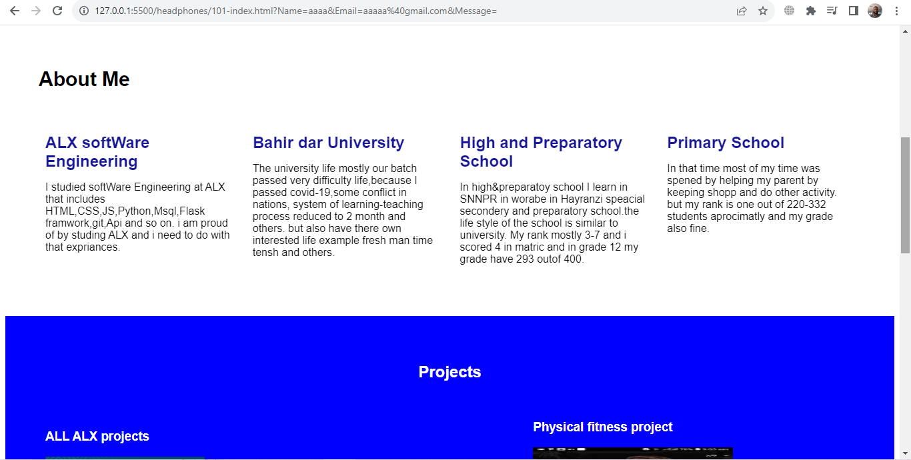

# Portfolio website
To design and implement a personal portfolio website, you can follow these steps:
# home view

# About me view

# projects view

# skills view

# contacts view

Define the Structure: I plan and  Decide on the sections I want to include, such as "About Me," "Skills," "Projects," and "Contact." This will help I create a clear and organized navigation menu.

Visual Design: Create a visually appealing design for your website. Choose a color scheme, typography, and overall theme that aligns with your personal brand. Ensure that the design is consistent and user-friendly.

About Me Section: Write a compelling introduction about yourself and your background. Highlight your skills, experiences, and achievements. You can also include a professional photo of yourself.

Skills Section:Iused  List of technical skills, programming languages, frameworks, and tools that  are proficient in. I can organize them into categories or use visual elements like progress bars to indicate your proficiency levels.

Projects Section: Showcase your projects with brief descriptions, images, and links to live demos or source code repositories. Include the technologies used and the problem each project solves. This section should demonstrate your abilities and accomplishments.

Contact Information: Provide your contact information, such as email address and social media profiles. You can also include a contact form for users to reach out to you directly from the website.

Responsive Design: Ensure that my website is responsive and looks good on different devices and screen sizes. i Test it on mobile devices, tablets, and desktop computers to ensure a seamless user experience.

Implement the Design: Use HTML, CSS, and JavaScript to implement the design and functionality of your website.